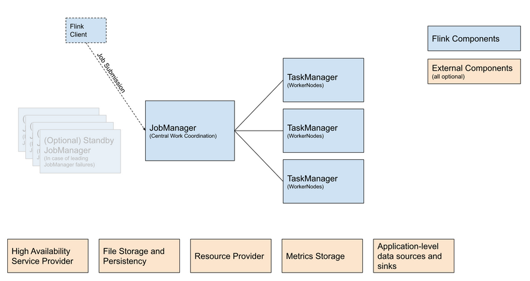

Apache Flink 是一个分布式计算框架，它能够对有界和无界的数据流进行高效的处理。

    有界数据：即批数据（离线数据），具有已定义的起止位置，属于静态数据集
    无界数据：即流式数据（实时数据），无已定义的结束位置，属于动态数据集# Flink 学习笔记

## 1. Flink介绍
### What is Flink
Apache Flink 是一个分布式计算框架，它能够对有界和无界的数据流进行高效的处理。

- 有界数据：即批数据（离线数据），具有已定义的起止位置，属于静态数据集
- 无界数据：即流式数据（实时数据），无已定义的结束位置，属于动态数据集


批处理是有界数据流处理的范例。在这种模式下，你可以选择在计算结果输出之前输入整个数据集，这也就意味着你可以对整个数据集的数据进行排序、统计或汇总计算后再输出结果。

流处理正相反，其涉及无界数据流。至少理论上来说，它的数据输入永远不会结束，因此程序必须持续不断地对到达的数据进行处理。

### Flink Architecture
Flink 的架构与大数据中常见的分布式架构（如 HDFS、HBase、Spark 等）相似，都遵循主从模式。
下图为官方提供的 Flink 架构图：


图中蓝色部分为 Flink 核心组件：
|组件名|组件职责|实现|
|---|---|---|
|Flink Client|Flink 客户端，可以将作业提交给 JobManager|Command Line Interface、REST Endpoint、SQL Client、Python REPL、Scala REPL|
|JobManager|Flink 的中心协调组件|Standalone、Kubernetes、YARN、Mesos|
|TaskManager|执行 Flink 作业的进程|

橙色部分为外部支撑组件：
|组件名|组件职责|实现|
|---|---|---|
|High Availability Service Provider|高可用性服务提供商|Zookeeper、Kubernetes HA|
|File Storage and Persistency|外部文件系统|HDFS、Alluxio、阿里云 OSS|
|Resource Provider|资源提供者|Yarn、Mesos、Kubernetes|
|Metrics Storage|Flink 指标模块|JMX、InfluxDB、Prometheus|

### Flink Concept
|概念|说明|
|---|---|
|Task|一个阶段多个功能相同 subTask 的集合，类似于 Spark 中的 TaskSet|
|SubTask|Flink 中任务最小执行单元，是一个 Java 类的实例，这个 Java 类中有属性和方法，完成具体的计算逻辑|
|Slot|Flink 中计算资源进行隔离的单元，一个 Slot 中可以运行多个 subTask，但是这些 subTask 必须是来自同一个 Application 的不同阶段的 subTask|
|State|Flink 在运行过程中计算的中间结果|
|Source|Flink 作业的数据源，可以是本地文件、Socket、Kafka 等|
|Transformation|负责数据处理的算子，包括 map、filter、reduce 等|
|Sink|Flink 作业的数据存放点，可以是 MySQL、Kafka 等|

## 2. Flink 咋用
### 2.1 requirements
- java 17
- maven 3.8.6
- docker
- docker-compose

### 2.2 单机模式(SocketWindowWordCount 需要三个terminal)
- 第一步 进入flink目录
```bash
wget https://dlcdn.apache.org/flink/flink-1.20.0/flink-1.20.0-bin-scala_2.12.tgz --no-check-certificate

tar -xzf flink-1.20.0-bin-scala_2.12.tgz
cd flink-1.20.0
```

- 第二步 启动集群
```bash
./bin/start-cluster.sh
```
我们启动了2个进程：JobManager的JVM 和 TaskManager的JVM。JobManager正在为Web界面提供可访问的Web界面： Localhost：8081 。

- 第三步 打开浏览器访问ip:8081

- 第四步 开启端口
```bash
nc -lk 9999
```

- 第五步 提交作业（job）
```bash
./bin/flink run examples/streaming/SocketWindowWordCount.jar --port 9999
```

- 第六步 发送信息并查看输出
```bash
tail -f log/flink-*-taskexecutor-*.out
```
- 第七步 停止集群
```bash
./bin/stop-cluster.sh
```

- 删除所有信息
```bash
rm log/*
```

### 2.3 docker集群 session_mode(SocketWindowWordCount 需要三个terminal)
- 第一步 在background启动集群
``` bash
cd 02-flink/application_mode
# or
cd 02-flink/session_mode

docker compose up

# Scale the cluster up or down to N TaskManagers
docker compose scale taskmanager=<N>
```

- 第二步 访问JobManager容器 并发送信息
```bash
docker exec -it $(docker ps --filter name=jobmanager --format={{.ID}}) /bin/sh
apt update && apt install netcat -y
nc -lk 9999
```

- 第三步 提交作业
```bash
docker exec -it $(docker ps --filter name=jobmanager --format={{.ID}}) /bin/sh
./bin/flink run examples/streaming/SocketWindowWordCount.jar --hostname jobmanager --port 9999
```

- 第四步 终结集群
```bash
docker compose down
```

- 可以通过localhost:8081 访问 web ui

### 2.4 docker集群 application_mode
- 第一步 进入application_mode目录
```bash
cd 02-flink/application_mode
FLINK_PROPERTIES="jobmanager.rpc.address: jobmanager"
```

- 第二步 创建网络
```bash
docker network create flink-network
```

- 第三步 启动监听端口并发送信息
```bash
nc -lk 9999
```

- 第四步 提交作业
```bash
docker compose up --build
```

- 第五步 终结集群并删除网络
```bash
docker compose down -v
docker network prune
```

## 参考网站
- https://github.com/apache/flink

- https://nightlies.apache.org/flink/flink-docs-master/zh/
- https://nightlies.apache.org/flink/flink-docs-master/zh/docs/deployment/cli/
- https://nightlies.apache.org/flink/flink-docs-master/zh/docs/deployment/resource-providers/standalone/docker/
- https://nightlies.apache.org/flink/flink-docs-master/zh/docs/deployment/resource-providers/standalone/overview/

- https://magicpenta.github.io/docs/flink/Flink%20%E5%BF%AB%E9%80%9F%E5%85%A5%E9%97%A8/

- https://github.com/apache/flink-connector-kafka/tree/main
- https://github.com/lydtechconsulting/flink-kafka-connector
- https://nightlies.apache.org/flink/flink-docs-master/zh/docs/connectors/datastream/kafka/
