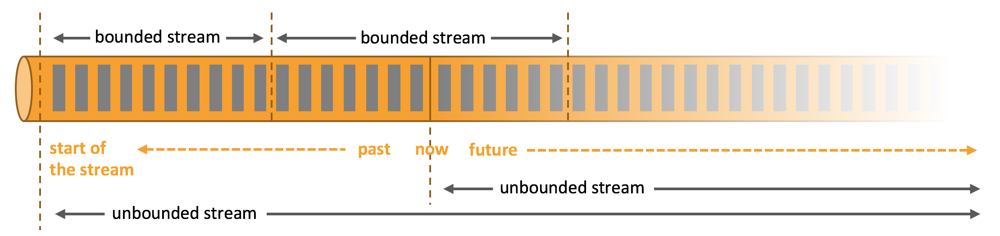

Apache Flink 是一个分布式计算框架，它能够对有界和无界的数据流进行高效的处理。

    有界数据：即批数据（离线数据），具有已定义的起止位置，属于静态数据集
    无界数据：即流式数据（实时数据），无已定义的结束位置，属于动态数据集# Flink 学习笔记

## 1. 什么是 Flink
Apache Flink 是一个分布式计算框架，它能够对有界和无界的数据流进行高效的处理。

- 有界数据：即批数据（离线数据），具有已定义的起止位置，属于静态数据集
- 无界数据：即流式数据（实时数据），无已定义的结束位置，属于动态数据集


## 2. Flink 咋用
### 2.1 requirements
- java 17
- maven 3.8.6
- docker
- docker-compose

### 2.2 单机模式(SocketWindowWordCount)
- 第一步 进入flink目录
```bash
wget https://dlcdn.apache.org/flink/flink-1.20.0/flink-1.20.0-bin-scala_2.12.tgz --no-check-certificate

tar -xzf flink-1.20.0-bin-scala_2.12.tgz
cd flink-1.20.0
```

- 第二步 Start Cluster
```bash
./bin/start-cluster.sh
```
我们启动了2个进程：JobManager的JVM 和 TaskManager的JVM。JobManager正在为Web界面提供可访问的Web界面： Localhost：8081 。

- 第三步 打开浏览器访问ip:8081

- 第四步 开启端口
```bash
nc -lk 9999
```

- 第五步 运行程序
```bash
./bin/flink run examples/streaming/SocketWindowWordCount.jar --port 9999
```

- 第六步 发送信息并查看输出
```bash
tail -f log/flink-*-taskexecutor-*.out
```
- 第七步 停止程序
```bash
./bin/stop-cluster.sh
```

- 删除所有信息
```bash
rm log/*
```


## 参考网站
- https://github.com/apache/flink

- https://nightlies.apache.org/flink/flink-docs-master/zh/
- https://nightlies.apache.org/flink/flink-docs-master/zh/docs/deployment/cli/
- https://nightlies.apache.org/flink/flink-docs-master/zh/docs/deployment/resource-providers/standalone/docker/
- https://nightlies.apache.org/flink/flink-docs-master/zh/docs/deployment/resource-providers/standalone/overview/


- https://github.com/apache/flink-connector-kafka/tree/main
- https://github.com/lydtechconsulting/flink-kafka-connector
- https://nightlies.apache.org/flink/flink-docs-master/zh/docs/connectors/datastream/kafka/
