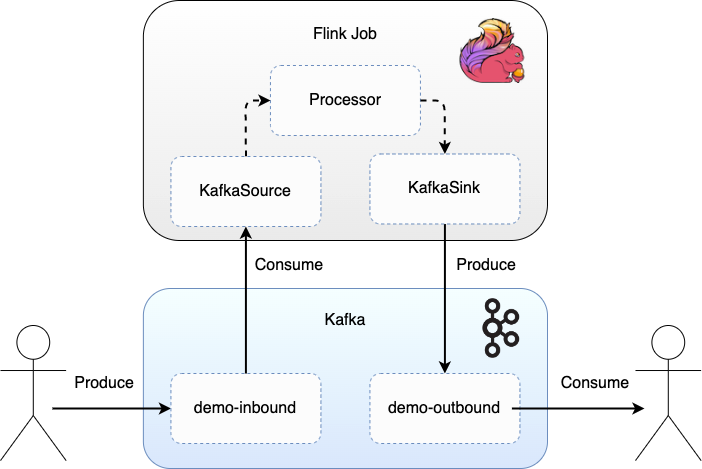
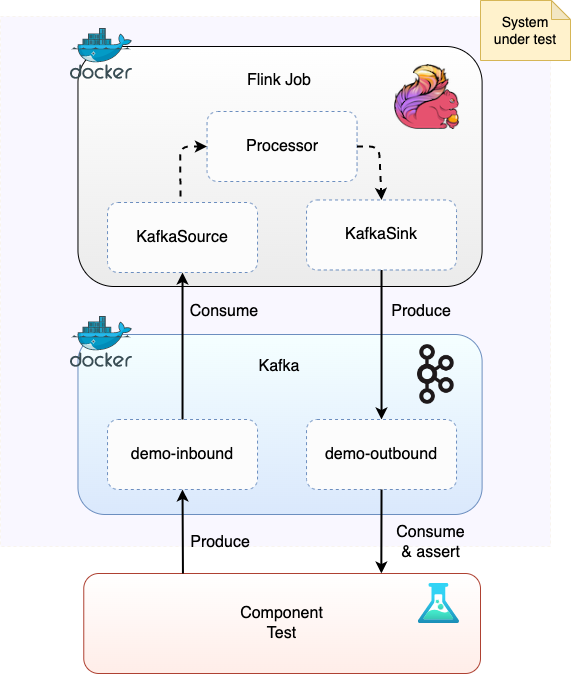

# Kafka & Flink 学习笔记

## 1. 架构

## 2. 这玩意儿咋用
### 2.1 requirements
- java 17
- maven 3.8.6
- docker
- docker-compose（应该与docker一起安装）

### 2.2 lydtechconsulting version
#### 2.2.1flink application_mode
- 第一步 创建workspace
```bash
git clone https://github.com/lydtechconsulting/flink-kafka-connector.git
cd flink-kafka-connector
```

- 第二步 安装依赖
```bash
mvn clean install
# need to check the version of artifact component-test-framework is 3.8.0 in pom.xml
```

- 第三步 启动集群
```bash
docker compose up -d
```

- 第四步 创建topic
```
docker exec -ti kafka kafka-topics --create --topic=demo-inbound --partitions 3 --if-not-exists --bootstrap-server=kafka:9093
docker exec -ti kafka kafka-topics --create --topic=demo-outbound --partitions 3 --if-not-exists --bootstrap-server=kafka:9093
docker exec -ti kafka kafka-topics --list --bootstrap-server=kafka:9093
```

- 第五步 提交作业（job）<br>
    访问 Flink 控制台： localhost:8081

    - 点击 `Add New`
    - 从 `target` 目录选择 `flink-kafka-connector-1.0.0.jar`，点击该 jar 包
    - 在 `Program Arguments` 中输入 Kafka 引导服务器地址：`kafka:9093`
    - 点击 `Submit` 提交


    另外，也可以手动运行 Flink 应用（或启用远程调试手动运行）：
```
java -jar target/flink-kafka-connector-1.0.0.jar
```

远程调试
使用方法：
- 启动应用程序时使用此命令
- 在你的IDE中（如IntelliJ IDEA或Eclipse）：
- 设置"远程JVM调试"配置
- 指向localhost:5005
- 启动调试会话
```
java -agentlib:jdwp=transport=dt_socket,server=y,suspend=n,address=*:5005 -jar target/flink-kafka-connector-1.0.0.jar
```

- 第六步 发送信息
```bash
docker exec -ti kafka kafka-console-producer --topic demo-inbound --bootstrap-server kafka:9093

{"name":"John Smith"}
```

- 第七步 消费信息
```bash
docker exec -ti kafka kafka-console-consumer --topic demo-outbound --bootstrap-server kafka:9093 --from-beginning
```
预期输出（名字已转为大写）：`{"name":"JOHN SMITH"}`

- 第八步 停止集群
```bash
docker compose down -v
```
#### 2.2.2 component_test_framework


- 安装依赖
```
mvn clean install
```

- 构建docker镜像
```
docker build -t ct/flink-kafka-connector:latest .
```

- 运行测试
```
mvn test -Pcomponent
```

- 运行测试并保持容器运行
```
mvn test -Pcomponent -Dcontainers.stayup
```

- 手动清理（如果容器未关闭）
```
docker rm -f $(docker ps -aq)
```

- 进一步清理（如果网络/其他问题）
```
docker system prune
docker volume prune
docker network prune
```

### 2.3 apache version
- 第一步 创建workspace
```bash
git clone https://github.com/apache/flink-connector-kafka.git
cd flink-connector-kafka
```

- 第二步 替换 KafkaExample.java<br>
    1. 原本的 KafkaExample.java 仅支持 integer(4字节大小), 但是当你使用kafka consumer时，即使你指定了IntegerSerializer，输入默认也会被当作字符串处理, 所以需要替换为StringSerializer
    2. setBounded 替换为 setStartingOffsets。setBounded意味着它只处理作业启动后到达的新消息，而当时如果没有任何消息需要处理，那么job会立即结束。
    3. KafkaExample1.java 与 KafkaExample2.java 都可以

- 第三步 安装依赖
```bash
mvn clean install
```

- 第四步 启动集群
```bash
docker-compose up -d
```

- 第五步 创建topic
```bash
docker exec kafka kafka-topics \
    --create \
    --topic test-input \
    --bootstrap-server kafka:9093 \
    --replication-factor 1 \
    --partitions 1

docker exec kafka kafka-topics \
    --create \
    --topic test-output \
    --bootstrap-server kafka:9093 \
    --replication-factor 1 \
    --partitions 1

docker exec kafka kafka-topics --list --bootstrap-server kafka:9093
```

- 第六步 消费信息
```bash
docker exec -it kafka kafka-console-consumer \
    --bootstrap-server kafka:9093 \
    --topic test-output \
    --from-beginning
```

- 第七步 发送信息
```bash
docker exec -it kafka kafka-console-producer \
    --broker-list kafka:9093 \
    --topic test-input
```

- 第八步 提交作业
```bash
wget https://dlcdn.apache.org/flink/flink-1.20.0/flink-1.20.0-bin-scala_2.12.tgz --no-check-certificate

tar -xzf flink-1.20.0-bin-scala_2.12.tgz
cd flink-1.20.0

./bin/start-cluster.sh

./bin/flink run ../flink-connector-kafka/flink-connector-kafka-e2e-tests/flink-streaming-kafka-test/target/KafkaExample.jar \
    --input-topic test-input \
    --output-topic test-output \
    --bootstrap.servers localhost:9092 \
    --group.id myconsumer
```

- 第九步 停止集群
```bash
./bin/stop-cluster.sh
docker-compose down -v
docker rm -f $(docker ps -aq)
docker system prune
docker volume prune
docker network prune
```

## 参考网站
- https://github.com/apache/flink-connector-kafka/tree/main
- https://github.com/lydtechconsulting/flink-kafka-connector
- https://github.com/lydtechconsulting/component-test-framework?tab=readme-ov-file
- https://nightlies.apache.org/flink/flink-docs-master/zh/docs/connectors/datastream/kafka/
- https://www.lydtechconsulting.com/blog-flink-kafka-connector.html
