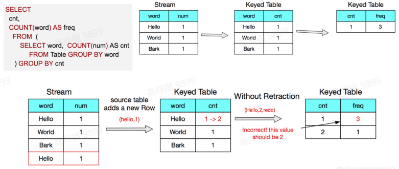

# 简易流计算系统设计

## 一、背景

### 1.1 项目介绍
流式计算系统是现在大数据场景下各个业务方都会经常使用的系统，广泛应用在终端数据、金融风控、实时推荐等场景。相比于传统的批式计算系统，流式计算系统还拥有实时性、可持续性、支持乱序性等典型特点。本项目要求同学们分组合作实现一个可用的简易流式系统，需要参与自我设计和开发工作，对基础编程、数据结构、网络、分布式、大数据基础组件有较好的技能锻炼，希望能够加深同学们对流式计算的理解。

### 1.2 项目目标
简易版流式计算系统整体功能拆分到三个级别，完成对应的功能能够获得对应权重的分数，请大家务必做好团队分工与协调。
| 目标 | 说明 |
|------|------|
| 基础流式系统运作（必须） | 能够一个完成多节点、端到端、可持续运行的流式系统，能够完成流式计算基础功能 |
| 中级流式系统特性（可选）   | 支持事件时间语义下的 window 处理并支持有限乱序数据 支持 retract 处理 支持自动故障恢复 |
| 高级流式系统特性（不做实现要求） | 支持 exactly once 处理语义 |

### 1.3 项目要求
- 4-8 人一组；
- 代码建议以 Java 为选型，但不做强要求；
- 开发测试用机器请自行准备；
- 开发测试用 Kafka 需要自行搭建，版本不限。

## 二、详细设计

### 1. 初级功能

#### 1.1 设计基础流式作业 API
在实际开始设计你们的简易流计算系统前，你们需要首先设计并实现一套流计算 API 来编写流计算应用。 你们需要定义一个抽象的数据结构来表示一个无界的数据流（后文称之为 DataStream），然后定义一套 API，你们的 API 应该能：
##### 1. 支持下面 5 个基础算子：
    | 算子 | 输入 | 输出 |
    |------|------|------|
    | Source | Kafka | DataStream |
    | Sink | DataStream | 外部文件 |
    | Map | DataStream | DataStream |
    | KeyBy | DataStream | DataStream（按照 key 分割后的） |
    | Reduce | DataStream（按照 key 分割后的） | DataStream |
##### 2. 支持基于处理时间的滚动窗口；
##### 3. 支持为算子指定并发度的功能；
##### 4. 支持以 DAG 形式编排使用所有支持的算子。
    说明：
    - Kafka 需要自己搭建，版本不限。
    - 建议将 API 设计成一个用配置文件表达的形式，用户可以在配置文件中指定各个算子的上下游关系和具体实现。

#### 1.2 实现基础分布式流式计算引擎
接下来，你们需要设计实现一个基础的分布式的流式计算引擎了。
- 它支持你们设计的 API 所支持的全部算子。
- 它拥有一个基础的 CLI/提交脚本来让用户可以方便的提交使用你们设计的 API 编写的流式应用。
- 它支持接收提交的流式应用后分发计算逻辑代码并调度算子到不同的计算节点上进行分布式计算。
- 它支持在不同节点间对中间数据进行 shuffle，包括上下游并发度不同时的分发、按 key partition 时的分发，具体实现方式不限。
说明：
- 可以预先手工起好集群。
- 集群的节点可以通过配置写死。
- 不要求考虑节点崩溃问题。

#### 1.3 实现一个流式 WordCount 应用
万事具备，只欠东风。使用你们自己设计的 API 来实现一个流式 WordCount 应用吧！
|  | 说明 | 示例 |
|------|------|------|
| 输入 | 无限输入流：每个元素是一个 {word,count} 键值对 | APPLE,1 pie,1 apple,1 |
| 输出 | 流式输出基于处理时间的 5 分钟滚动窗口内的 word count： - 把窗口触发时间一并输出 - 统计时大小写不敏感 | 2022/07/18T12:00:00,apple,1 2022/07/18T12:00:00,pie,1 2022/07/18T12:05:00,apple,2 |

### 2. 中级功能
恭喜你们已经实现了一个简易的流式计算系统！你们的系统赢得了一些潜在客户的关注，但是在购买你们的系统之前，他们希望你们能支持一些高级功能。

#### 2.1 支持基于事件时间的 Window 处理
你们的客户提出他们需要基于事件时间下的 window 处理能力，并支持有限乱序数据。请回顾下《流计算中的 Window 处理》一课，继续拓展你们的流式计算 API 并支持：
| 功能 | 说明 |
|------|------|
| 基于事件时间的 Window，支持有限乱序数据 | 任意一种 window 类型皆可，需要支持 watermark 机制并基于此实现对处理有限乱序数据的支持，watermark 生成策略任选 |

当然，你们需要自己设计一个 demo 来展示你们的系统确实具备了相应的能力。

#### 2.2 支持 retract 计算
你们的客户指出如果他们继续拓展先前演示的 WordCount 应用，编写一个统计不同 count 数的 word 分别有多少个的应用，由于你们的流计算系统没有支持 retract 计算，会得到错误的结果，请拓展你们的系统支持 retract 计算。

#### 2.3 支持自动故障恢复
生产环境中故障是很常见的，你们的客户提出他们需要一个可容错的流计算系统并要求你们的系统在计算节点故障后能够实现：
1. 自动重新拉起计算节点进程；
2. 重建上下游算子连接恢复计算；
3. 恢复计算状态。
说明：
- 只需要支持 at-least once 计算语义。
- 具体实现方式不限，但是请简单论证为什么你们实现了 at-least once 计算语义。

### 3. 高级功能
#### 3.1 实现 exactly once 计算语义
你们的客户进一步提出他们不能容忍数据重复消费，因此希望你们支持 exactly once 计算语义。请设计一个 demo 来证明给你们的客户你们确实实现了 exactly once 计算语义。
提示：
- 回顾 《Exactly Once 语义在 Flink 中的实现》一课。
- 可以认为节点上的本地文件不会丢失。

## 三、 提交方式
1. 请自行申请一个公开的 GitHub/GitLab 仓库，把代码提交到该仓库，并且强烈建议在开发过程中就直接使用 GitHub/GitLab 进行团队代码管理。
2. 代码项目根目录需要有 README 文档，该文档至少包含该项目的基本模块介绍、如何部署启动该项目、如何验证该项目等可执行的清晰流程。
3. 请准备一份答辩汇报文档，包含包括架构设计、功能测试、性能测试等模块，可以参考【模板】青训营结业项目答辩汇报文档。
4. 请准备一个最长 15 分钟的演示视频，讲解你们系统的各个功能点的设计与实现并现场演示 demo。

## 四、评估标准
项目主要从功能实现完整度、代码质量、性能等维度进行考核，分项评分规则如下所示。

| 功能 | 评分项 |
|------|--------|
| 基础功能 （50 %） | 设计实现流式 API 并能把计算表达为 DAG 形式 |
|        | 实现读取 Kafka 的 Souce 算子 |
|        | 实现写入外部文件的 Sink 算子 |
|        | 实现支持自定义映射函数的 Map 算子 |
|        | 实现支持自定义规约函数的 Reduce 算子 |
|        | 实现基于处理时间的滚动窗口 |
|        | 支持按 DAG 描述的算子上下游关系对算子进行调度执行 |
|        | 支持节点间数据 shuffle |
|        | 实现一个流式 WordCount 应用 |
| 中级功能 （30 %） | 实现基于事件时间的 Window，支持有限乱序数据
|        | 支持 retract 计算 |
|        | 支持自动故障恢复  - 自动拉起计算进程 (2.5 %)  - 重建上下游算子连接恢复计算 (2.5 %)  - 恢复计算状态并支持 at-least once 语义 (5 %) |
| 高级功能 （10 %） | 实现 exactly once 计算语义  - 系统内 exactly once (5 %)  - 端到端 exactly once (5 %) |
| 工程实践 （10 %） | 整体架构设计合理性与报告/演示质量 |
|        | 以下各 1.5 %： - 是否使用 git 进行团队代码管理 - 模块划分是否合理 - 代码测试是否完善 - 代码注释是否完善 |

## 五、参考
1. [MapReduce-百度百科](https://baike.baidu.com/item/MapReduce/133425)
2. [Streaming 101: The world beyond batch](https://www.oreilly.com/radar/the-world-beyond-batch-streaming-101/)
3. [Apache Flink: Stateful Computations over Data Streams](https://flink.apache.org/)
4. [Apache Storm](https://storm.apache.org/)